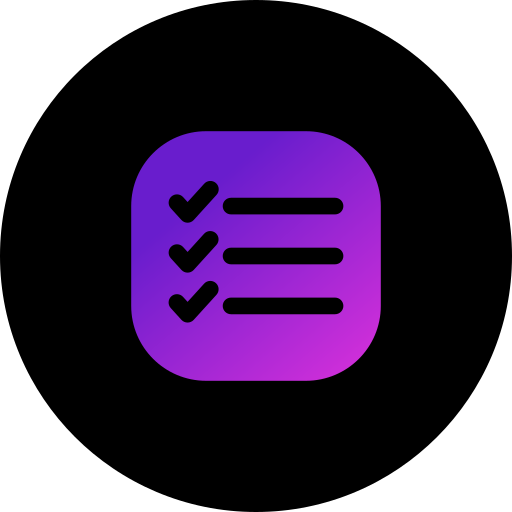
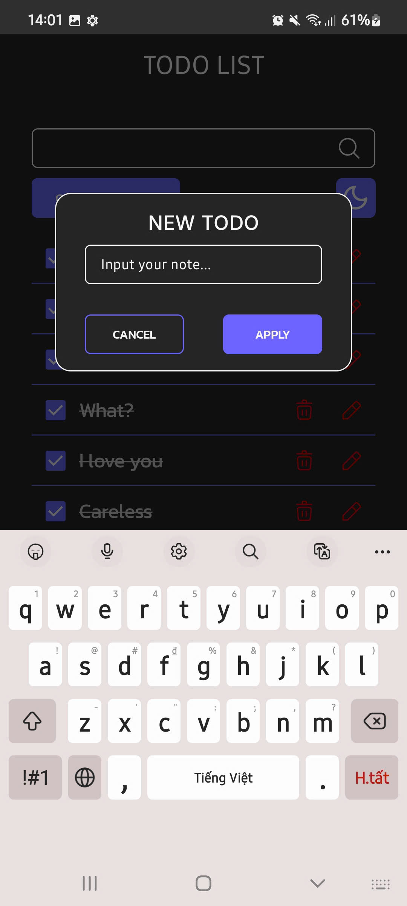
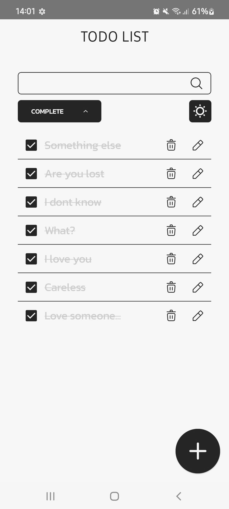
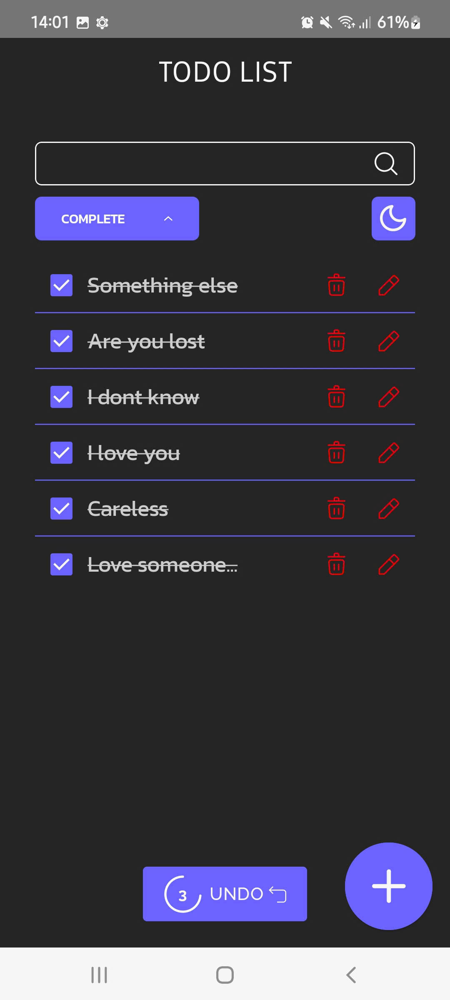

# Simple ToDo App
<p align ="center">
    
</p>

Một app ToDo đơn giản, được xây dựng bởi
[Jetpack Compose](https://developer.android.com/jetpack/compose). Để có thể sử dụng app này, 
hãy sử dụng phiên bản mới nhất của [Android Studio](https://developer.android.com/studio).
Bạn có thể clone repository này hoặc import project từ Android Studio. 


## Ảnh chụp
<p align="center">
    
    
    
 
</p>

## Tính chất
App bao gồm 4 tính chất CRUD (Create - Read - Update - Delete), chỉ bao gồm một màn hình chính.
Và một số tính năng phụ khác.

## Công nghệ Sử dụng
- [Jetpack Compose](https://developer.android.com/jetpack/compose)
- [Hilt-Dagger](https://dagger.dev/hilt/).
- [Room Database](https://developer.android.com/training/data-storage/room).
## Dẫn nguồn
 App sử dụng thiết kế UI Figma của tác giả [Dima Dzubenko](https://www.figma.com/community/file/1287029163993360080), bản quyền thuộc [CC BY 4.0](https://creativecommons.org/licenses/by/4.0/).
 
## Bản quyền

```
Custom License for Simple ToDo App

Copyright (c) 2025 NhuHuy-79

Permission is granted to use this software for personal and non-commercial purposes only.
Commercial use, distribution, or modification of this software is strictly prohibited 
without explicit written permission from the author.

If you wish to modify this software, you must contact the author.

THE SOFTWARE IS PROVIDED "AS IS", WITHOUT WARRANTY OF ANY KIND.

```

## Liên lạc 
- Email: *nguyennhuhuy42@gmail.com*
- Facebook:
[Bá Đặng](https://www.facebook.com/nhu.huy.42)
